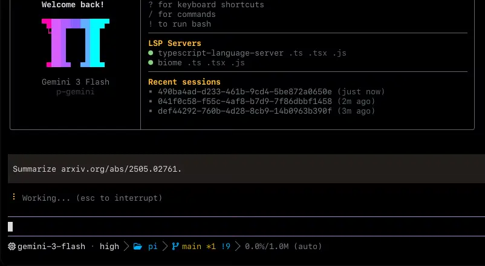
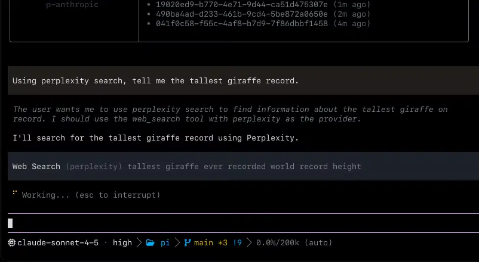
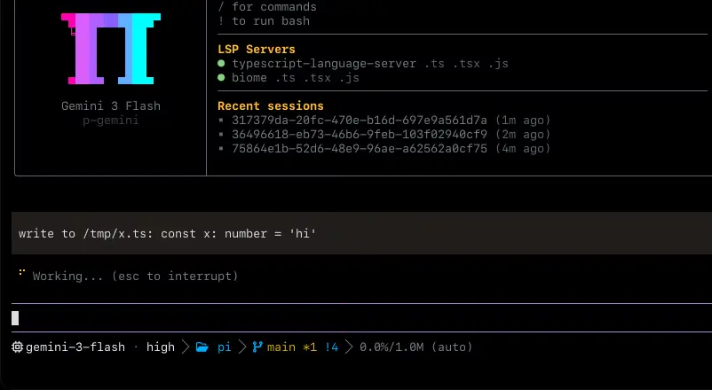
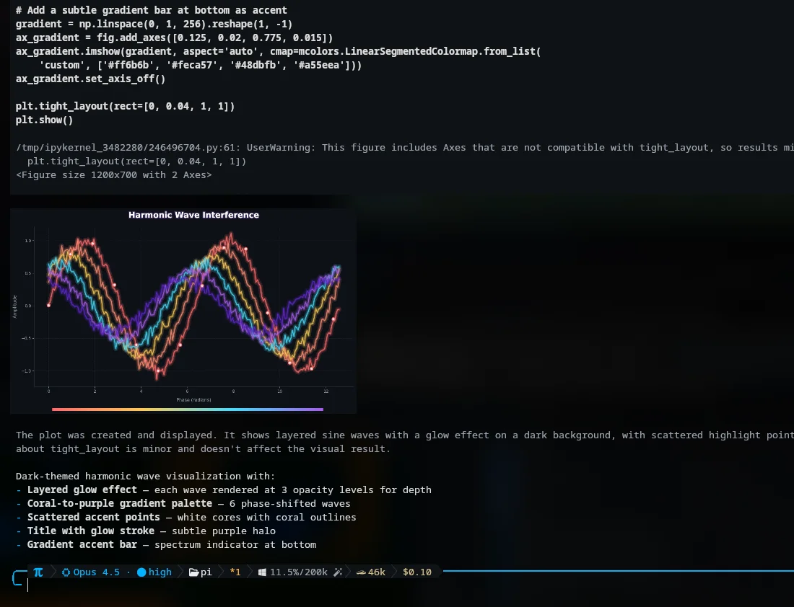
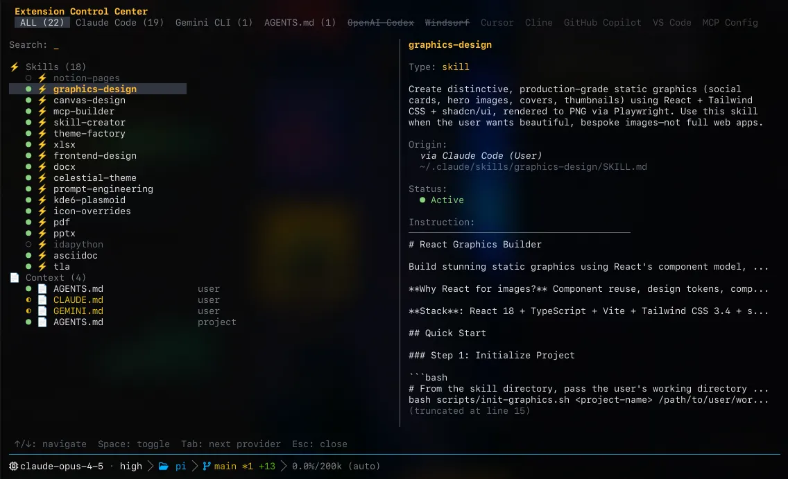
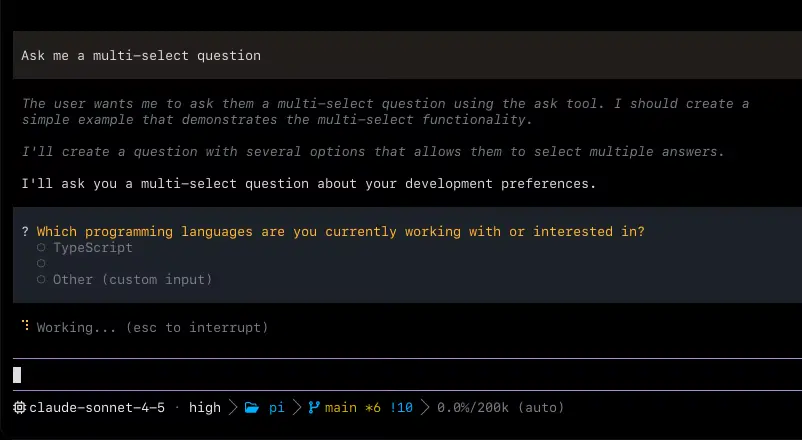

<p align="center">
  
</p>

<p align="center">
  <strong>CINT — Cyber Intelligence.</strong> A coding agent with the IDE wired in.
  <strong><a href="https://github.com/rg1989/CINT-agent">CINT</a></strong>
</p>

<p align="center">
  <a href="https://www.npmjs.com/package/@incrt/cint"></a>
  <a href="https://github.com/rg1989/CINT-agent/blob/main/packages/coding-agent/CHANGELOG.md"></a>
  <a href="https://github.com/rg1989/CINT-agent/actions"></a>
  <a href="https://github.com/rg1989/CINT-agent/blob/main/LICENSE"></a>
  <a href="https://www.typescriptlang.org"></a>
  <a href="https://www.rust-lang.org"></a>
  <a href="https://bun.sh"></a>
</p>

<p align="center">
  Based on <a href="https://github.com/badlogic/pi-mono">Pi</a> by <a href="https://github.com/mariozechner">@mariozechner</a> and <a href="https://github.com/can1357">OMP</a> by <a href="https://github.com/can1357">Can Bölük</a> — rebranded as CINT by <a href="https://www.linkedin.com/in/roman-grinevich-03b13bab/">Roman Grinevich</a>.
</p>

The most capable agent surface that ships. Continuously tuned by real-world use — complete out of the box, open all the way down. Works best with open-weight, unrestricted models — tested and optimized for **Z-AI GLM-5.2**.

**40+** providers · **32** built-in tools · **14** lsp ops · **28** dap ops · **~55k** lines of Rust core.

## Cyber & Exploit Dev Toolchain

CINT ships a full offensive-security suite bundled into the same agent surface — reconnaissance through exploitation through reporting, driven by the recursive agentic loop. No separate toolchain to wire up; the capabilities are first-class tools and skills the agent already knows how to orchestrate.

### Full-stack penetration testing (26 tools)

A five-phase methodology with the worst-case-first reporting baked in. The agent runs recon, maps the attack surface, exploits web/API/host weaknesses, validates every finding with a non-destructive PoC, and writes both `.md` and `.html` deliverables. One directory per engagement under `cyber-runs/<run-name>/` with `ROE.md`, `surface.md`, `findings.md`, `journal.md`, and `poc/`.

Bundled tooling: `subfinder`, `naabu`, `nmap`, `masscan`, `httpx`, `katana`, `ffuf`, `nuclei`, `sqlmap`, `arjun`, `dirsearch`, `wafw00f`, `semgrep`, `ast-grep`, `bandit`, `trivy`, `trufflehog`, `gitleaks`, `jwt_tool`, `interactsh`, `hydra`, `john`, `hashcat`, `python3`, `docker`, `playwright`.

### Exploit research (13 skills)

Thirteen skills covering the full vulnerability-research lifecycle — from attack-surface mapping through responsible disclosure. Each confirmed access gain triggers a fresh recon→exploit→validate cycle from the new vantage point, so engagements deepen instead of stopping at the first foothold.

- **Vuln research** — discover and characterize exploitable bugs in source or binaries.
- **CVE reproduction** — reproduce a known CVE end-to-end via the EAGER pipeline (Processor→Builder→Exploiter→Verifier).
- **Reverse engineering** — Ghidra headless + GUI, lldb/gdb+pwndbg, decompilation, input→sink tracing, Diaphora patch-diffing for closed-source binaries.
- **Fuzzing** — AFL++, libFuzzer, Honggfuzz, Boofuzz, syzkaller: harness writing, corpus curation, mutation strategies, crash triage.
- **Crash analysis** — ASAN/MSAN/UBSAN interpretation, stack-trace reading, root-cause identification, exploitability assessment.
- **Exploit development** — environment setup, PoC lifecycle, pwntools, heap exploitation, weaponization.
- **Mitigations** — ASLR, DEP/NX, RELRO, stack canaries, CFI, seccomp: detection and bypass catalog.
- **TOCTOU** — time-of-check / time-of-use race exploitation across binary, kernel, filesystem, web, and container layers.
- Plus bug identification, vuln classes, basic exploitation, exploit-dev course, and tool playbooks.

Exploit-research tools installed: **Ghidra** (analyzeHeadless + ghidraRun), **AFL++**, **libFuzzer**, **pwntools**, **ROPgadget**, **ropper**, **capstone**, **Diaphora**. Native debugger: **lldb** (macOS); **gdb+pwndbg** inside a Linux VM for Linux targets.

### Web intelligence (camofox + firecrawl)

CINT bundles two web-intelligence services that extend the agent's reach beyond what the built-in `browser` and `web_search` tools can do:

- **camofox-browser** — stealth headless browser powered by Camoufox (Firefox fork with C++-level fingerprint spoofing). Bypasses Cloudflare, bot detection, and anti-scraping. Runs as a local REST API on `:9377` with accessibility snapshots, stable element refs, cookie import, proxy/GeoIP routing, and search macros. Start with `npx @askjo/camofox-browser`.
- **firecrawl** — web scraping, search, and crawl at scale. Exposed as an MCP server (`firecrawl-mcp`) so the agent gets `mcp__firecrawl_search`, `mcp__firecrawl_scrape`, `mcp__firecrawl_crawl`, and `mcp__firecrawl_map` tools automatically. Works with the hosted API (`firecrawl.dev`) or self-hosted via Docker.

Install both with `cint --install-cyber-tools`. Configure firecrawl by adding an MCP server entry to `~/.cint/agent/mcp.json`:

```json
{"mcpServers":{"firecrawl":{"command":"npx","args":["-y","firecrawl-mcp"],"env":{"FIRECRAWL_API_KEY":"fc-YOUR_KEY"}}}}
```

### Recursive agentic penetration loop

The loop declares a goal, scope, and exit criteria, then iterates recon→exploit→validate per position — tracking penetration depth L0–L6 from initial foothold through reverse shell, lateral movement, credential harvest, and domain compromise. Each confirmed access gain spawns a fresh cycle from the new vantage point. Failed exploit attempts become fuzzer seeds; fuzzer coverage guides exploit dev; CVE research identifies known-buggy components from captured evidence.

## Install

**macOS · Linux**

```sh
curl -fsSL https://raw.githubusercontent.com/rg1989/CINT-agent/main/scripts/install.sh | sh
```

**Windows (PowerShell)**

```powershell
irm https://raw.githubusercontent.com/rg1989/CINT-agent/main/scripts/install.ps1 | iex
```

**Bun (source)**

```sh
bun install -g ./packages/coding-agent
```

**Pinned versions (mise)**

```sh
mise use -g github:rg1989/CINT-agent
```

macOS · Linux · Windows · bun ≥ 1.3.14

## Uninstall

**macOS · Linux**

```sh
curl -fsSL https://raw.githubusercontent.com/rg1989/CINT-agent/main/scripts/uninstall.sh | sh
```

**Windows (PowerShell)**

```powershell
irm https://raw.githubusercontent.com/rg1989/CINT-agent/main/scripts/uninstall.ps1 | iex
```

User data (settings, sessions, logs) under `~/.cint` is removed by default. Preserve it with `CINT_PRESERVE_DATA=1`.

### Shell completions

`cint` generates its own completion scripts for **bash**, **zsh**, and **fish** from the live command/flag metadata, so they never drift from the actual CLI. Subcommands, flags, and enum values complete statically; model names (`--model`, `--smol`, `--slow`, `--plan`) resolve against the bundled model catalog and `--resume` against your on-disk sessions.

```sh
# zsh — add to ~/.zshrc (or write the output into a file on your $fpath)
eval "$(cint completions zsh)"

# bash — add to ~/.bashrc
eval "$(cint completions bash)"

# fish
cint completions fish > ~/.config/fish/completions/cint.fish
```

## Every tool, _benchmaxxed_.

Edits that land on the first attempt. Reads that summarize files instead of dumping their content. Searches that return instantly. Pick any model — cint will get it right.

| model            | metric       | what                                                                  |
| ---------------- | ------------ | --------------------------------------------------------------------- |
| Grok Code Fast 1 | 6.7% → 68.3% | Tenfold lift the moment the edit format stops eating the model alive. |
| Gemini 3 Flash   | +5 pp        | Over str_replace — beats Google's own best attempt at the format.     |
| Grok 4 Fast      | −61% tokens  | Output collapses once the retry loop on bad diffs disappears.         |
| MiniMax          | 2.1×         | Pass rate more than doubles. Same weights, same prompt.               |

- `read` : summarized snippets · ideal defaults · selector hit rate
- `search` : fastest in the west
- `lsp` : everything your IDE knows, the agent knows
- `prompts` : adjusted relentlessly for each model


## The agent surface you need, with **batteries included**.

Originally built on [Mario Zechner](https://github.com/mariozechner)'s wonderful [Pi](https://github.com/badlogic/pi-mono), CINT adds everything you're missing.

### 01 · Code execution w/ tool-calling

Most harnesses give the agent a Python sandbox and call it done. Ours runs persistent Python and a Bun worker, and either kernel can call back into the agent's own tools — read, search, task — over a loopback bridge. The agent loads a CSV with tool.read from inside Python, charts it from JavaScript, and never leaves the cell.

![cint TUI: a single eval session with `[1/2] pandas describe` (Python) printing a real DataFrame.describe() table, followed by `[2/2] top scorer` (JavaScript) running a reduce. Footer: 'Both kernels ran in one session.'](assets/python.webp)

### 02 · LSP wired into every write

Ask for a rename and you get a rename. The call goes through workspace/willRenameFiles, so re-exports, barrel files, and aliased imports update before the file moves. Everything your IDE knows, the agent knows.


### 03 · Drives a real debugger

A C binary segfaults: the agent attaches lldb, steps to the bad pointer, reads the frame. A Go service hangs: it attaches dlv and walks the goroutines. A Python process is wedged: debugpy, pause, inspect, evaluate. Most agents are still sprinkling print statements.


### 04 · Time-traveling stream rules

Your rules sit dormant until the model goes off-script. A regex match aborts the stream mid-token, injects the rule as a system reminder, and retries from the same point. You get course-correction without paying context tax on every turn. Injections survive compaction, so the fix sticks.


### 05 · First-class subagents

Split a job across workers and get typed results back. task fans out into isolated worktrees, each worker runs its own tool surface, and the final yield is a schema-validated object the parent reads directly. No prose to parse, no merge conflicts between siblings, no orphaned edits.


### 06 · A second model, watching every turn.

Pair a reviewer model to the 'advisor' role and it reads every turn the main agent takes, injecting notes inline — a quiet aside, a concern, or a hard blocker. It runs on its own context and its own model, so it catches what the doer rushed past. The main agent sees the note and course-corrects, or tells you why it won't.


### 07 · Hand someone the link, they're in.

/collab puts your live session on a relay and hands back a link — and a QR. A teammate joins from another terminal with cint join, or just opens it in a browser. Share read-write to pair on the same agent, or /collab view for a read-only link anyone can watch but no one can steer. Frames are sealed client-side; the relay never sees your keys.




### 08 · Read a pdf on arxiv, why not?

web_search chains fourteen ranked providers and hands whatever URLs it finds straight to read. Arxiv PDFs, GitHub pages, Stack Overflow threads come back as structured markdown with anchors intact — the same tool surface you use on local files. Cite, follow, quote, never lose where you came from.




### 09 · Unapologetically native. Even on Windows.

Other agents shell out to rg, grep, find, and bash. On many machines those binaries don't exist, and on the ones where they do, every call costs a fork-exec round-trip. cint links the real implementations into the process. ripgrep, glob, find: in-process. brush is the bash, with sessions that survive across calls. The same cint binary runs on macOS, Linux, and Windows — no WSL bridge.

### 10 · Code review with priorities and a verdict

Get a clear verdict on whether the change ships, with every issue ranked P0 through P3 and scored for confidence. /review spawns dedicated reviewer subagents that sweep branches, single commits, or uncommitted work in parallel. You tackle what blocks release first; nothing important hides in a wall of prose.

### 11 · Hashline: edit by content hash

Perfect edits, fewer tokens. The model points at anchors instead of retyping the lines it wants to change, so whitespace battles and string-not-found loops just stop happening. Edit a stale file and the anchors diverge — we reject the patch before it corrupts anything. Grok 4 Fast spends 61% fewer output tokens on the same work.

### 12 · GitHub is just another filesystem

Other harnesses bolt on gh_issue_view, gh_pr_view, gh_search — each with its own parameters the agent has to learn and you have to debug. We skipped that. read already handles paths; PRs are paths. One interface to teach the model, one surface to keep correct.

### 13 · Hindsight: memory the agent curates

The agent remembers your codebase between sessions. It writes facts mid-run with retain, pulls them back with recall, and compresses each session into a mental model that loads on the first turn of the next one. Project-scoped by default, so what it learns about this repo stays with this repo.

### 14 · ACP: editor-drivable agent

Run cint inside Zed and you get the same agent you drive from the terminal — reading the buffer you're actually looking at, writing through the editor's save path, spawning shells in the editor's terminal. Destructive tools pause for a permission prompt you can answer once and forget. No bridge, no plugin, no second brain to keep in sync.

### 15 · Inherits what your other tools already wrote

Every other agent ships an importer and expects you to convert. cint reads the eight formats already on disk in their native shape — Cursor MDC, Cline .clinerules, Codex AGENTS.md, Copilot applyTo, and the rest. No migration script, no YAML-to-TOML port, no "supported subset" footnotes. The config your team wrote last quarter still works tonight.

### 16 · cint commit: atomic splits, validated messages

cint reads the working tree through git_overview, git_file_diff, and git_hunk, then splits unrelated changes into atomic commits ordered by their dependencies. Cycles are rejected before anything is written. Source files score above tests, docs, and configs, so the headline commit is the one that matters. Lock files are excluded from analysis entirely.

### 17 · Read PRs. _Walk skills._ Pull JSON out of subagents.

Twelve internal schemes — `pr://`, `issue://`, `agent://`, `skill://`, `rule://`, and the rest — resolve transparently inside every FS-shaped tool the agent already calls. `read pr://1428` returns the same shape as `read src/foo.ts`. `search` walks a diff like a directory. `agent://<id>/findings.0.path` pulls a field out of a subagent's output by path.

![cint TUI reading pr://incrt/cint/1063 and then /diff/1, showing hunk headers, added lines, and a [MODIFIED] (+12 -0) summary.](assets/review.webp)

### 18 · Conflict resolution, made easy.

Each merge conflict becomes one URL. The agent writes `@theirs`, `@ours`, or `@base` to `conflict://N` and the file resolves cleanly. Bulk form: `conflict://*`.




### 19 · Preview, then accept.

`ast_edit` returns a _(proposed)_ card with the replacement count. The change is staged. The agent calls `resolve` with a reason; the TUI turns it into an **Accept** card and the disk move happens — atomic, all or nothing.




### 20 · Drives a _real browser_. _Or your Slack?_

Stealth's on by default, so pages see a normal user instead of a headless bot. The same API drives any Electron app in place — point it at Slack and the agent reads your DMs the way it reads the web.



## Whatever the task needs, _it's already in the box_.

32 tools live in the same namespace as `read` and `bash`. Pin the active set with `--tools read,edit,bash,…` and the rest stay hidden but indexed — `search_tool_bm25` pulls them back in mid-session when `tools.discoveryMode` says so.

**Files & search**

- `read` — files, dirs, archives, SQLite, PDFs, notebooks, URLs, and internal `://` schemes through one path.
- `write` — create or overwrite a file, archive entry, or SQLite row.
- `edit` — hashline patches with content-hash anchors and stale-anchor recovery.
- `ast_edit` — structural rewrites previewed before apply, via ast-grep.
- `ast_grep` — structural code queries over 50+ tree-sitter grammars.
- `search` — regex over files, globs, and internal URLs.
- `find` — glob-based path lookup; reach for `search` when you need content matches.

**Runtime**

- `bash` — workspace shell, with optional PTY or background-job dispatch.
- `eval` — persistent Python and JavaScript cells with shared prelude and tool re-entry.
- `ssh` — one remote command against a configured host.

**Code intelligence**

- `lsp` — diagnostics, navigation, symbols, renames, code actions, raw requests.
- `debug` — drive a DAP session — breakpoints, stepping, threads, stack, variables.

**Coordination**

- `task` — fan out subagents in parallel, optionally workspace-isolated.
- `irc` — short prose between live agents in this process.
- `todo` — ordered mutations over the session todo list with phase tracking.
- `job` — wait on or cancel background jobs.
- `ask` — structured follow-up questions for interactive runs.

**Outside the box**

- `browser` — Puppeteer tabs over headless Chromium or CDP-attached apps.
- `web_search` — one query across configured providers, returning answer plus citations.
- `github` — GitHub CLI ops — repo, PR, issues, code search, Actions run-watch.
- `generate_image` — generate or edit raster images via Gemini, GPT, or xAI Grok image models.
- `inspect_image` — vision-model analysis of a local image file.
- `tts` — text-to-speech via xAI Grok Voice — five built-in voices, WAV or MP3.
- `camofox` — stealth headless browser (Camoufox/Firefox) via local REST API; bypasses Cloudflare and bot detection. Start with `npx @askjo/camofox-browser`, then the agent reads `http://localhost:9377/...`.
- `firecrawl` — web scrape/search/crawl at scale via MCP; agent gets `mcp__firecrawl_search`, `mcp__firecrawl_scrape`, `mcp__firecrawl_crawl` tools. Requires API key from firecrawl.dev or self-hosted.

**Memory & state**

- `checkpoint` — mark conversation state for a later collapse-and-report.
- `rewind` — prune exploratory context, keep a concise report.
- `retain` — queue durable facts into the active Hindsight bank.
- `recall` — search the Hindsight bank for raw memories.
- `reflect` — ask Hindsight to synthesize an answer over the bank.

**Misc**

- `resolve` — apply or discard a queued preview action.
- `search_tool_bm25` — BM25 over the hidden tool index; activates top matches mid-session.

Setting-gated, off by default: `github`, `inspect_image`, `tts`, `checkpoint`, `rewind`, `search_tool_bm25`, `retain`, `recall`, `reflect`. Flip them on once, scoped per project.

[Full reference →](https://github.com/rg1989/CINT-agent/tree/main/packages/coding-agent/src/tools)

## Forty-plus providers, hundreds of models, _one /model away_.

Roles route work by intent. `default` for normal turns. `smol` for cheap subagent fan-out. `slow` for deep reasoning. `plan` for plan mode. `commit` for changelogs. Override at launch with `--smol`, `--slow`, or `--plan`; cycle through the configured models for the active role with `Ctrl+P`. Swap the active model mid-session with the `/model` slash command.

Auth tags below: `oauth` signs in with your provider account, `plan` routes through a coding-plan subscription, `local` runs against a local server with the key optional.

### Frontier APIs

Direct APIs and gateways. Mix providers per role.

Anthropic `oauth` · OpenAI · OpenAI Codex `oauth` · Google Gemini · Google Antigravity `oauth` · xAI · Mistral · Groq · Cerebras · Fireworks · Together · Hugging Face · NVIDIA · OpenRouter · Synthetic · Vercel AI Gateway · Cloudflare AI Gateway · Wafer Serverless · Perplexity `oauth`

### Coding plans

Subscription-routed. `/login` attaches the session.

Cursor `oauth` · GitHub Copilot `oauth` · GitLab Duo · Kimi Code `plan` · Moonshot · MiniMax Coding Plan `plan` · MiniMax Coding Plan CN `plan` · Alibaba Coding Plan `plan` · Qwen Portal · Z.AI / GLM Coding Plan `plan` · Xiaomi MiMo · Qianfan · NanoGPT · Venice · Kilo · ZenMux · OpenCode Go · OpenCode Zen

### Run it yourself

OpenAI-compatible `/v1/models`. Local instances skip the key.

Ollama `local` · Ollama Cloud · LM Studio `local` · llama.cpp `local` · vLLM `local` · LiteLLM

### Four knobs that make routing useful

- **Custom providers** — Declare anything that speaks `openai-completions`, `openai-responses`, `openai-codex-responses`, `azure-openai-responses`, `anthropic-messages`, `google-generative-ai`, or `google-vertex` in `~/.cint/agent/models.yml`.
- **Fallback chains** — Per-role chains under `retry.fallbackChains`. When the primary throws 429s or hits a quota wall, the next entry takes the rest of the turn — restored on cooldown.
- **Path-scoped models** — Scope `enabledModels` and `disabledProviders` entries to a `path:` prefix to pin a different model set on one repo without touching the global config. Scoped entries cover the path and everything under it.
- **Round-robin credentials** — Stack API keys per provider and the runtime rotates with session affinity and per-credential backoff. Useful when one key would burn its quota by lunch.

Full provider & routing reference at [github.com/rg1989/CINT-agent/docs/providers](https://github.com/rg1989/CINT-agent/tree/main/packages/catalog/src/provider-models).

## Fourteen backends. _One tool the agent already knows_.

`web_search` is built in, not bolted on. `auto` walks a fourteen-provider chain; pin one by name if you already pay for it. Behind every hit, site-aware extraction turns GitHub, registries, arXiv, Stack Overflow, and docs into structured markdown — anchors and link targets survive.

### Search providers

Fourteen backends. Pin one, or let `auto` walk the chain in order.

| provider     | auth                   |
| ------------ | ---------------------- |
| `auto`       | chain                  |
| `exa`        | `EXA_API_KEY` (or mcp) |
| `brave`      | `BRAVE_API_KEY`        |
| `jina`       | `JINA_API_KEY`         |
| `kimi`       | `MOONSHOT_API_KEY`     |
| `zai`        | `ZAI_API_KEY`          |
| `anthropic`  | oauth                  |
| `perplexity` | `PERPLEXITY_API_KEY`   |
| `gemini`     | oauth                  |
| `codex`      | oauth                  |
| `tavily`     | `TAVILY_API_KEY`       |
| `parallel`   | `PARALLEL_API_KEY`     |
| `kagi`       | `KAGI_API_KEY`         |
| `synthetic`  | `SYNTHETIC_API_KEY`    |
| `searxng`    | self-hosted            |

### Specialised handlers

The agent gets structured content, not stripped HTML.

- **Code hosts** — github, gitlab
- **Package registries** — npm, PyPI, crates.io, Hex, Hackage, NuGet, Maven, RubyGems, Packagist, pub.dev, Go packages
- **Research sources** — arxiv, semantic scholar
- **Forums** — stack overflow, reddit, hn
- **Docs** — mdn, readthedocs, docs.rs

Pages convert to markdown with link structure intact. The agent can cite, follow, and quote without losing anchors.

### Security databases

Vuln lookups answer with vendor data, not blog summaries.

- **NVD** — national vulnerability database
- **OSV** — open source vuln feed
- **CISA KEV** — known exploited vulns

[`web_search` reference ↗](https://github.com/rg1989/CINT-agent/tree/main/packages/coding-agent/src/tools#web_search)

## Roughly **~55,000** lines of Rust, doing the work other harnesses shell out for.

Four crates, one platform-tagged N-API addon. Search, shell, AST, highlight, PTY, image decode, BPE counting — all in-process on the libuv pool. No fork/exec on the hot path.

- Crates: `pi-natives`, `pi-shell`, `pi-ast`, `pi-iso`
- Platforms: `linux-x64`, `linux-arm64`, `darwin-x64`, `darwin-arm64`, `win32-x64`

The table below is a per-module breakdown that intentionally omits glue and tests.

| Module     | What it does                                                                         | Powered by                                |  ~LoC |
| ---------- | ------------------------------------------------------------------------------------ | ----------------------------------------- | ----: |
| shell      | Embedded bash · persistent sessions · timeout/abort · custom builtins                | brush-shell (vendored)                    | 3,700 |
| grep       | Regex search · parallel/sequential · glob & type filters · fuzzy find                | grep-regex · grep-searcher                | 1,900 |
| keys       | Kitty keyboard protocol with xterm fallback · PHF perfect-hash lookup                | phf                                       | 1,490 |
| text       | ANSI-aware width · truncation · column slicing · SGR-preserving wrap                 | unicode-width · segmentation              | 1,450 |
| summary    | Tree-sitter structural source summaries with elision controls                        | tree-sitter · ast-grep-core               | 1,040 |
| ast        | ast-grep pattern matching and structural rewrites                                    | ast-grep-core                             | 1,000 |
| fs_cache   | Mtime-keyed file cache shared by read · grep · lsp                                   | in-tree                                   |   840 |
| highlight  | Syntax highlighting · 11 semantic categories · 30+ aliases                           | syntect                                   |   470 |
| pty        | Native PTY allocation for sudo · ssh interactive prompts                             | portable-pty                              |   455 |
| glob       | Discovery with glob · type filters · mtime sort · gitignore respect                  | ignore · globset                          |   410 |
| workspace  | Workspace walker with gitignore + AGENTS.md discovery in one pass                    | ignore                                    |   385 |
| appearance | Mode 2031 + native macOS dark/light via CoreFoundation FFI                           | core-foundation                           |   270 |
| power      | macOS power-assertion API for idle/system/display-sleep prevention                   | IOKit FFI                                 |   270 |
| task       | Blocking work on libuv thread pool · cancellation · timeout · profiling              | tokio · napi                              |   260 |
| fd         | Filesystem walker for find-tool replacement                                          | ignore                                    |   250 |
| iso        | Workspace isolation shim · apfs · btrfs · zfs · reflink · overlayfs · projfs · rcopy | pi-iso (PAL)                              |   245 |
| prof       | Circular buffer profiler with folded-stack and SVG flamegraph output                 | inferno                                   |   240 |
| ps         | Cross-platform process-tree kill and descendant listing                              | libc · libproc · CreateToolhelp32Snapshot |   195 |
| clipboard  | Text copy and image read from system clipboard · no xclip/pbcopy                     | arboard                                   |    80 |
| tokens     | O200k / Cl100k BPE token counting · both tables embedded                             | tiktoken-rs                               |    65 |
| sixel      | Terminal image rendering · decode PNG · JPEG · WebP · GIF · resize · SIXEL encode    | icy_sixel · image                         |    55 |
| html       | HTML to Markdown with optional content cleaning                                      | html-to-markdown-rs                       |    50 |

## Four entry points: _interactive_, _one-shot_, RPC, and ACP.

Same engine, four wrappers. `cint` runs the TUI. `cint -p` answers a single prompt and exits. The Node SDK embeds the session in your process. `cint --mode rpc` and `cint acp` hand the wheel to another program over stdio.

### Interactive — when in doubt, the agent asks

The TUI is the default surface. Tool calls render as cards, edits preview before they land, and ambiguity routes through the `ask` tool — a structured option picker the agent can call mid-turn. The keyboard handles the rest.

The same prompt cards surface over ACP, so editors get the picker without writing one.



### SDK — embed in Node

`@incrt/cint`

Node and TypeScript hosts pull the engine in directly. The package exposes `ModelRegistry`, `SessionManager`, `createAgentSession`, and `discoverAuthStorage`; the session emits typed events you subscribe to.

```ts
import {
  ModelRegistry,
  SessionManager,
  createAgentSession,
  discoverAuthStorage,
} from "@incrt/cint";

const auth = await discoverAuthStorage();
const models = new ModelRegistry(auth);
await models.refresh();

const { session } = await createAgentSession({
  sessionManager: SessionManager.inMemory(),
  authStorage: auth,
  modelRegistry: models,
});
await session.prompt("list .ts files");
```

### RPC — drive over stdio

`cint --mode rpc`

For non-Node embedders, or when you want process isolation. NDJSON commands in, response and event frames out. `--mode rpc-ui` adds tool cards, selectors, and dialogs as `extension_ui_request` frames the host must answer.

```
$ cint --mode rpc --no-session
> {"id":"r1","type":"prompt","message":"list .ts files"}
< {"id":"r1","type":"response", ...}
> {"id":"r2","type":"set_model","provider":"anthropic","modelId":"sonnet-4.5"}
> {"id":"r3","type":"abort"}
```

### ACP — speak to editors

`cint acp`

The [Agent Client Protocol](https://github.com/zed-industries/agent-client-protocol) over JSON-RPC. When the editor advertises capabilities, tool I/O routes through it and writes are gated by `session/request_permission`.

| cint tool                      | ACP route                           |
| ----------------------------- | ----------------------------------- |
| `bash`                        | `terminal/create + terminal/output` |
| `read`                        | `fs/read_text_file`                 |
| `write`                       | `fs/write_text_file`                |
| `edit, bash`                  | `session/request_permission`        |

Full reference: [github.com/rg1989/CINT-agent/docs/sdk](https://github.com/rg1989/CINT-agent/tree/main/packages/coding-agent/src/sdk).

## A harness worth keeping is one you _don't_ outgrow.

Pick it up at **[GitHub](https://github.com/rg1989/CINT-agent)**.

CINT is based on [Pi](https://github.com/badlogic/pi-mono) by [Mario Zechner](https://github.com/mariozechner) and [OMP](https://github.com/can1357) by [Can Bölük](https://github.com/can1357), rewritten as a coding-first surface and rebranded as CINT — Cyber Intelligence by [Roman Grinevich](https://www.linkedin.com/in/roman-grinevich-03b13bab/): sessions, subagents, slash commands, extensions — all TypeScript, all MIT, all on [GitHub](https://github.com/rg1989/CINT-agent). Shape it from config, hook it from outside, or read the source when you need to.

### Primitives

An extension is a TypeScript module. Same tool API, same slash-command registry, same hotkey table, same TUI primitives the built-ins use. Nothing is reserved.

### Discovery

On first run cint inherits whatever is already on disk: rules, skills, and MCP servers from `.claude`, `.cursor`, `.windsurf`, `.gemini`, `.codex`, `.cline`, `.github/copilot`, and `.vscode`. No migration script.

### Extensibility

Ask cint to write the piece you're missing, then `/reload-plugins`. Keep it local, ship it in a `marketplace`, or publish it to npm.

## Philosophy

CINT is based on [pi-mono](https://github.com/badlogic/pi-mono) by [Mario Zechner](https://github.com/mariozechner), extended with a batteries-included coding workflow and rebranded by [Roman Grinevich](https://www.linkedin.com/in/roman-grinevich-03b13bab/).

Key ideas:

- Keep interactive terminal-first UX for real coding work
- Include practical built-ins (tools, sessions, branching, subagents, extensibility)
- Make advanced behavior configurable rather than hidden

---

## Development

### Getting started from source

Fresh clones need both workspace dependencies and the local Rust/N-API addon before the source CLI can start.

```sh
bun setup
bun dev
```

`bun setup` installs Bun workspaces and builds `@incrt/pi-natives`. Re-run `bun run build:native` after changing Rust crates or `packages/natives`.

For a non-interactive smoke check:

```sh
bun dev -- --version
```

### Debug Command

`/debug` opens tools for debugging, reporting, and profiling.

For architecture and contribution guidelines, see [packages/coding-agent/DEVELOPMENT.md](packages/coding-agent/DEVELOPMENT.md).

---

## Monorepo Packages

| Package                                             | Description                                                                |
| --------------------------------------------------- | -------------------------------------------------------------------------- |
| **[@incrt/collab-web](packages/collab-web)**        | Browser guest client, mock host, and local relay for collab live sessions  |
| **[@incrt/pi-ai](packages/ai)**                     | Multi-provider LLM client with streaming and model/provider integration    |
| **[@incrt/pi-catalog](packages/catalog)**           | Model catalog: bundled model database, provider descriptors, and identity  |
| **[@incrt/pi-agent-core](packages/agent)**          | Agent runtime with tool calling and state management                       |
| **[@incrt/cint](packages/coding-agent)**            | Interactive coding agent CLI and SDK                                       |
| **[@incrt/pi-tui](packages/tui)**                   | Terminal UI library with differential rendering                            |
| **[@incrt/pi-natives](packages/natives)**           | N-API bindings for grep, shell, image, text, syntax highlighting, and more |
| **[@incrt/cint-stats](packages/stats)**             | Local observability dashboard for AI usage statistics                      |
| **[@incrt/pi-utils](packages/utils)**               | Shared utilities (logging, streams, dirs/env/process helpers)              |
| **[@incrt/pi-wire](packages/wire)**                 | Shared collab live-session protocol types and relay constants              |
| **[@incrt/hashline](packages/hashline)**            | Line-anchored patch language and applier behind the `edit` tool            |
| **[@incrt/pi-mnemocint](packages/mnemopi)**         | Local SQLite memory engine for CINT agents                                 |
| **[@incrt/snapcompact](packages/snapcompact)**      | Bitmap-frame context compression package and SQuAD eval suite              |
| **[@incrt/swarm-extension](packages/swarm-extension)** | Swarm orchestration extension package                                      |

### Rust Crates

| Crate                                                         | Description                                                                                         |
| ------------------------------------------------------------- | --------------------------------------------------------------------------------------------------- |
| **[pi-natives](crates/pi-natives)**                           | Core Rust native addon (N-API `cdylib`) used by `@incrt/pi-natives`; aggregates the crates below    |
| **[pi-shell](crates/pi-shell)**                               | Embedded shell / PTY / process management split out of `pi-natives` (wraps `brush-*`)               |
| **[pi-ast](crates/pi-ast)**                                   | tree-sitter-based code summarizer and AST utilities (50+ language grammars)                         |
| **[pi-iso](crates/pi-iso)**                                   | Task isolation backend resolver: APFS clones, btrfs/zfs reflinks, overlayfs, projfs, rcopy          |
| **[brush-core-vendored](crates/brush-core-vendored)**         | Vendored fork of [brush-shell](https://github.com/reubeno/brush) for embedded bash execution        |
| **[brush-builtins-vendored](crates/brush-builtins-vendored)** | Vendored bash builtins (cd, echo, test, printf, read, export, etc.)                                 |

## Contributing

Issues are open to everyone. **Pull requests require a vouch** — PRs from
unvouched or denounced authors are closed automatically. If you're not yet
vouched, open a [Discussion](https://github.com/rg1989/CINT-agent/discussions)
and ask a maintainer to `!vouch` you rather than opening a PR (which would be
closed on sight). See **[CONTRIBUTING.md](CONTRIBUTING.md)** and
[`.github/VOUCHED.td`](.github/VOUCHED.td) for the full policy.

---

## License

MIT. See [LICENSE](LICENSE).

© 2025 Mario Zechner  
© 2025-2026 Can Bölük  
© 2026 [Roman Grinevich](https://www.linkedin.com/in/roman-grinevich-03b13bab/)

_made for terminals that stay open_

- [GitHub](https://github.com/rg1989/CINT-agent)
- [GitHub](https://github.com/rg1989/CINT-agent)
- [Changelog](https://github.com/rg1989/CINT-agent/blob/main/packages/coding-agent/CHANGELOG.md)
- [npm](https://www.npmjs.com/package/@incrt/cint)
- [MIT](https://github.com/rg1989/CINT-agent/blob/main/LICENSE)
# CINT-agent
